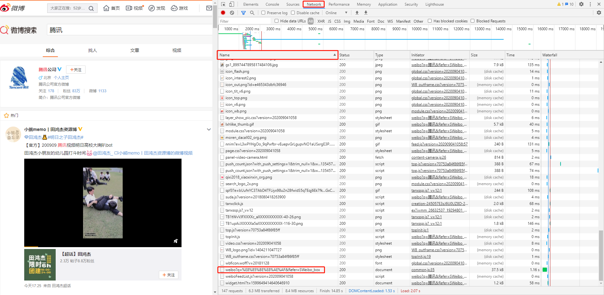
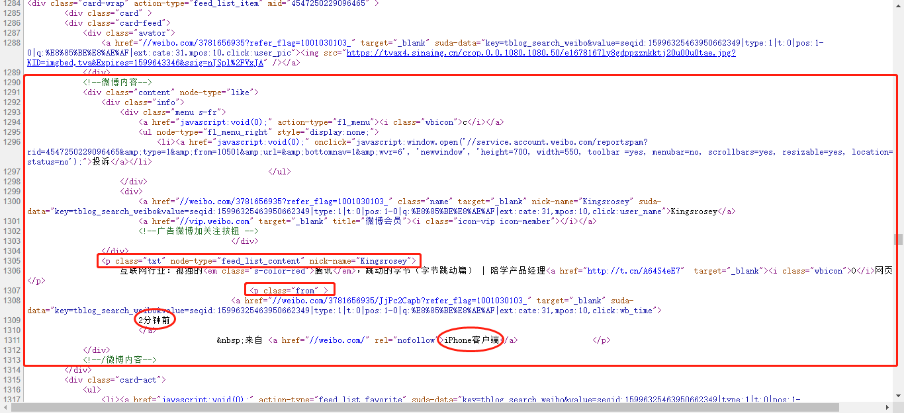

# WeiboCrawler
一款按关键字爬取微博内容的爬虫

## 具体步骤
1、进入新浪微博官方页面（https://weibo.com/）

2、登录自己的微博账号

3、打开浏览器开发者工具。如 Chrome 下按 `F12` 或在页面空白处点击右键打开菜单栏，选择 `检查`


4、在微博搜索框中输入任意关键字，进行一次搜索

5、在开发者工具中，依次选择 Network -> Name(按名称排序) -> weibo?q=%...（如果没有找到类似于该名称的资源，就换个关键字再搜索一次，直出现为止）



6、在 Request Headers 中找到 `Cookie` 和 `User-Agent` 字段，复制到 `config.json` 里的 `headers` 中


7、如果位于腾讯内网，则需要在 `config.json` 中设置如下代理（默认已设置）：
```
  "proxies" : {
    "http": "127.0.0.1:12639",
    "https": "127.0.0.1:12639"
  }
```

8、在 `config.json` 的 `options` 中加入自己想要检索的关键字，然后执行 `main.py`，便可以模拟浏览器登录状态进行微博内容爬取了。爬取完毕后会在项目目录下生成一个 excel 文件

## config.json 各字段解释
* options：微博检索的关键字
* startPage：爬取起始页页码
* maxPage：爬取的最大页码，不爬取超过此页码的内容
* headers：HTTP 请求头的内容，包含 `Connection`、`User-Agent`、`Cookie`
* proxies：HTTP 网络代理，若处于腾讯内网，则需要设置为 `127.0.0.1:12639`

## 页面元素分析
查看微博检索页面的源代码，可以发现检索到的每一条博文一般具有以下固定的格式：



可以看到 `<p class="txt" node-type="feed_list_content" nick-name="">...</p>` 中的 `nick-name` 属性值即为用户名，其 text 即为微博正文内容

可以看到 `<p class="from" >...</p>` 有两个子元素，分别是 `<a href="..." target="_blank" suda-data="...">发布时间</a>` 和 `<a href="..." rel="...">设备信息</a>` 。第一个子元素的 text 即为发布时间， `href` 属性值即为博文链接；第二个子元素的的 text 即为设备信息